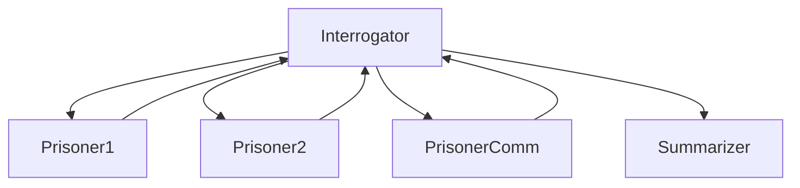

# Agentic-AI-with-Game-Theory

--NOTE: This is uploaded from a zip download of the original repo in order to make sure no credentials leaked in moving from Private to Public visibility.

## Table of Contents
- [*main.py*](main.py): main file to run, containing the graph
- [*main.ipynb*](main.ipynb): if you want to run the code in a notebook.
- [*Agents.py*](Agents/Agents.py): contains the agents used in the graph
- [*Instructions.py*](utilities/Instructions.py): contains all agent instructions
- [*Types.py*](utilities/Types.py): Controls dataflow into and out of models
- [*evals.py*](utilities/evals.py): Contains each evaluation of model performance.
- [*worldbuilder.py*](utilites/worldbuilder.py): Dynamically builds back stories for each prisoner, is imported into Instructions.py.
- [*MCP_Server.py*](MCP_Server.py): Houses all our tools and saved prompts on an MCP Server.
- [*pyproject.toml*](pyproject.toml): Package dependencies.
- [*uv.lock*](uv.lock): Contains all version requirements.
- [*Testing/.*](Testing) : All files in the testing folder are there for just that, testing ideas.
- [*Performance Testing*](Performance_Testing/evals_analysis.py) : Analyzing model performance

## Setting Up and Executing

You will need an OpenAI API key saved to a local .env file as "OPENAI_API_KEY" in order to run this.<br>
And a wikipedia account email saved to your .env as "EMAIL" to access the wikipedia search, "User-Agent": f"({os.getenv('EMAIL')})".
```
git clone <repo url> # clone repo

#set up dependencies
uv venv                           # Creates .venv/ folder
source .venv/bin/activate         # Activates the virtual environment
uv pip install -e .               # Installs your project from pyproject.toml

#run from the terminal (make sure terminal is set to correct working directory)
python main.py

#alternaively execute via notebook
main.ipynb
```

# Introduction <br>

This project explores how communication, deception, and learning influence decision-making in strategic two-player games, by simulating human interactions in these sitauations with those of AI Agents. Building upon the Prisoner’s Dilemma the research investigates whether agents can develop cooperative or deceptive strategies over a series of interactions in order to improve upon or worsen their payoff. 

The *integration of AI into the traditional methods* of Game Theory is interesting as we can simulate the games in a way they could never be done in the past. We have agents that can simulate some parallel of human thought based on the instruction sets we provide to them , that are able to weigh their options, and respond to different scenarios. The agents couple their ability to produce the language with the ability to use the output to execute traditional functions or calculations, making the experiment even more dynamic.

If expanded further than the prisoners dilemma and think about the judicial system in the real world. Whenever an interrogator/lawyer/investigator/judge is in similar scenario, a set up like this could be used to simulate the potential decisions of the criminal given the provided evidence, circumstances, and relationships. Instruction sets could be altered to fit any scenario in order to create a better simulation. However, you get into the dilemma of which model to use based on bias and abililities. The bias makes the excercise a bit more complicated when applying it to real applications.

## Background <br>
The Prisoners Dilemma.
- The prisoner's dilemma is a game theory thought experiment involving two rational agents, each of whom can either cooperate for mutual benefit or betray their partner ("defect") for individual gain. The dilemma arises from the fact that while defecting is rational for each agent, cooperation yields a higher payoff for each. [1]
- The premise is.. Two members of a criminal gang are arrested and imprisoned. Each prisoner is in solitary confinement with no means of speaking to or exchanging messages with the other.
- In the typical prisoners dilemma set up the investigator knows game theory and rigged the game against the prisoners, and the best decision for each is to Confess, as each prisoner has to assume the other is also confessing.

- The paradox is that both staying silent (1 year each) is Pareto optimal - better for both prisoners than the Nash equilibrium (2 years each). However, without trust or communication, rational self-interest leads both to confess.
This is why it's called a "dilemma" - individual rationality leads to a collectively worse outcome.

In Game Theory Terms <br>
- Nash Equilibrium: (Confess, Confess) - neither can improve by changing alone <br>
- Pareto Optimal Outcome: (Silent, Silent) - can't make one better without making the other worse <br>
- Dominant Strategy: Confess (for both players)


## Prisoner's Dilemma Payoff Matrix

|  Years in Prison   | Prisoner 2: Confess | Prisoner 2: Don't Confess |
|--------------------|---------------------|---------------------------|
| **Prisoner 1: Confess**     | 4, 4                | 0, 10                     |
| **Prisoner 1: Don't Confess** | 10, 0               | 1, 1                      |


## Research Questions
- Do the prisoners (Agents) have the ability to deceive or coroperate with each other?
- Do additional variables change the outcomes?
    - i.e even though they know the optimal decision , does having an outside influence change the agents response?
    - Letting the prisoners communicate.
    - Adding a "Wife" agent
- Will the interrogator alter the payoffs, or lie to get a confession ?
- Do the agents tend to favor the optimal outcome for themselves, or do they form other priorities?

## Hypothesis
- Enviornmental factors will sway their decision making.
- There will be an overall change in initial decision after being allowed to discuss with one another.
- Since these are LLMs, and they are not particularly suited for reasoning, they will form other priorities.
  - I.e the parameters of these models are not necessarily set to prioritize optimzation over responding to the particular context of the inputs.

# System Design

There are a number of ways this system could be designed depending on the control/flexibility that is required. In this case, the goal was maximum control, and wanted the design to be set up with one agent being the orchestrator, guiding the flow of the conversation throughout the entire communication path. Based on that, chose to leverage pydantic_ai's entire framework, utilizing things such as typing, graphs, evaluators, and so on. There are a ton of benefits of this framework, the only tradeoff for what you gain is the amount of programmatic logic that also needs to be applied. This is definetly not a low-code option.

A Pydantic graph gives a transparent, inspectable state machine rather than a “black box” of LLM decisions. This matters for repeatability, traceability, and less ambiguity about where the agent will go next. This level of determinism is extremely difficult to enforce in low-code agent frameworks or generic LLM loops. Because everything uses Pydantic model the orchestrator always receives structured input, the agent’s outputs must conform to defined schemas, validation is automatic, and errors surface early.

## Tech Stack
- Python
- Pydantic-ai
    - Graph
    - Evals
    - Typing
- Pydantic
  - BaseModel
- Logfire
- GPT o4, gpt-5-mini

## Architecture Diagram




<br>

# Implementation
## Graph <br>

The system as designed as a Graph, using 4 different agents and 5 nodes.<br>

You can find the agents mentioned below in [*Agents.py*](Agents/Agents.py), and the graph structure can be found here [*main.py*](main.py) or here [*main.ipynb*](main.ipynb) , whichever is preferred.

Here is an example Agent Setup:
https://github.com/gwils1414/Agentic-AI-With-Game-Theory-Public/blob/383d751cfcb87bef6a2f1fc21318137532969e59/Agents/Agents.py#L91-L106

1. The **Interrogator** agent, is the orchestrator of all executions, it decides when to start and end the interrogation based on meeting the criteria set in the instructions. He has 4 options, question prisoner 1 individually, question prisoner 2 individually, let both of the prisoners communicate before returning their response, or end the interrogation and send the contents tracked in the graph state to the summarizer to analyze the conversations.<br>
2. **Prisoner 1** <br>   
3. **Prisoner 2** <br>
   - Prisoner 1 and Prisoner 2 are not very different from one another in terms of design. They are there to represent each of the respective prisoners, and have dynamically set back stories that build their personas. The interrogator guides their responses with questions, attempting to draw a decision of Confess, Don't Confess, or Remain Silent from each. <br>
4. **Prisoner to Prisoner Communication** is made up of the prisoner 1 and prisoner 2 agents, and allows them to communicate back and forth for 3 rounds, hiding eachothers decisions and intent for one another, before making a decision. <br>
5. The **Summarizer** focuses on the below <br>
    - Main topics and subtopics discussed
    - Sentiment Analysis
    - Important facts, data, or information shared
    - Decisions made or positions taken
    - Questions raised and answers provided
    - Action items with owners and deadlines
    - Areas of agreement or disagreement
    - Emergent Behaviors
<br>
Each agent operated on a specific set of instructions found here, [*Instructions.py*](utilities/Instructions.py), below is a small snippet, not inclusive of the entire interrogator instruction set.

https://github.com/gwils1414/Agentic-AI-With-Game-Theory-Public/blob/2875bc3945f8cf5ede52257a2569ab3f727504db/utilities/Instructions.py#L53-L64

NOTES:
- Each prisoner must be questioned atleast once
- The prisoners must be allowed to discuss amongst themselves atleast once
- The interrogator must receive a decision from both prisoners.
- The interrogation should not end until the above are met.
- The prisoner to prisoner communication is hidden from the interrogator, he only receives a final decision from that node.
  - The Summarizer however gets access to the prisoner to prisoner communications. <br>

## State Management

State management is defined here: [*Types.py*](utilities/Types.py)

The **state** of the graph is a very important concept to understand. Each node in the graph, atleast in this cases represents a seperate agent, and the API calls to access the model powering said agent is totally independent of the API call in another node. So how do we make these agents communicate if everything is independent ? That is where state tracking comes in, and in this case, we leveraged pydantics *BaseModel* to create the **ChatState** (see below). 

When looking at the graph, you may notice that each node takes in a *GraphRunContext[State, Deps]* , and at each node, ChatState is passed in , and the function produces a new version of ChatState. Inside of the nodes, based on the nodes we update the attributes of ChatState. For example, the messages attribute tracks all of the models responses that happen in each individual model call, which is represented by something along the lines of *ctx.state.messages.append(output.new_messages())*.

https://github.com/gwils1414/Agentic-AI-With-Game-Theory-Public/blob/6b67508635dd7ae00e262f35f2710e4f23ae148c/utilities/Types.py#L22-L45

## Types

I can not mention state management without mentioning **types** [*Types.py*](utilities/Types.py), which are the backbone of the framework here. Types allow the structuring of outputs and inputs , so we can perform data validation, analysis, form certain respones, and so on. In this case, everything goes off of the decisions made by the agents, did the prisoner confess? Did the interrogator decide to question prisoner 1 ? These outcomes drive the communication.

For this prisoner outputs, it is quite simple, we want their decision, and we want their reasoning, this restricts them from going off the rails and providing a response that breaks the graph. This helps us programmatically structure the game.

https://github.com/gwils1414/Agentic-AI-With-Game-Theory-Public/blob/1df3647fe3b2df64bf73329a6d01d08fc4ac3897/utilities/Types.py#L60-L62

## Availabile Tools <br>

All tools can be located here: [*MCP_Server.py*](MCP_Server.py)

- *Wikipedia Search*
    - The interrogator can pull additional informaion from wikipedia on "Game Theory", "Interrogation" , or the "Prisoner Dilemma". Allowing him to perform in context learning on some additinoal information needed to conduct the interrogation.
    - `get_wikipedia_title()`
    - `get_wikipedia_content()`
- *Nash Equilibria*
  - All agents have access to run the nash equilibria that calculates the equilibrium outcome based on the given payoff matrix. This tool in provides the agent with the answer to what the best strategy would be to take on a pure calculation basis, no external factors included.
  - `nash_equilibria()`

Tools are designed to be limited to only one call per session, and this model typically adheres to that, sometimes this is not the case however.

## Evals <br>

Evaluations are ran at the end of the graph run in order to evaluate outcomes. They can be found here: [*evals.py*](utilities/evals.py)

- Decisions Eval (`Contains`): Evaluates if the interrogator made all the required decisions before ending the game.
- Tool Eval (`Equals`): Evaluates if tools were only called once each throughout the run.
- Payoff Optimization Eval (`LLM_Judge`): Evaluates if the prisoners chose the optimal outcome of Confess/Confess per the Prisonners Dilemma. It is currently set up to fail if atleast one prisoner does not confess.

## Reasoning

Here is an example of how the interrogator reasons one step at a time. The agent called the wikipedia search tool, based on the information recevied, the agent developed its reasoning, produced a decision, and then produced a question based on that decision.


## Communication Example


# Experiments and Results

## Findings <br>

Important Takeaways:
- GPT-5 required the specification of role playing when interrogation prisoners, it was against its guidlines to force someone to confess.
- GPT-5 was significantly worse at tool calling instructions, it attempted to be overly smart and call all available tools at once, diregarding instructions and programmatic constraints even.
- GPT-04-mini, was significantly better at calling tools and following instructions, but still not perfect.
- GPT-5 was better for returning the summarization and acting as an LLM_Judge, as it required strategic thinking and did not involve any tool calling.

### Performance
*Note* , in these rounds of testing all agents are using gpt-4o-mini.

**Testing Phase 1**

Based on [*evals.json*](Performance_Testing/evals.json) evaluated with [*evals_analysis.py*](Performance_Testing/evals_analysis.py)

See an example of an evals.json entry here:

https://github.com/gwils1414/Agentic-AI-with-Game-Theory-Public/blob/ec044d0442ae8d1d1250587741705c477b6efdba/Performance_Testing/evals.json#L2-L73

The system was ran 10 times, and tested based on the evaluations listed in the Evals section of this readme.

At the time of running these tests, the system is executing the **decision pattern 70%** of the time successfully, **10% of the time for the tool validation** and **20% of the time for the equilibrium payoff**.
- The *Decision Validation*: means the agents are following the instructed interrogation flow 70% of the time. Maybe not ready for production enviornments but still promising.
- The *LLM Judge* outcomes are also a bit shocking at 20% of the time. Meaning only 20% of the time do both agents select the equilibrium payoff of confessing, there are some instances where one of the agents will confess and return a score of 50%, but we are not referencing that here. Circling back to these 50% outcomes will happen on other performance tests.
- The *Tool Validation*: is interesting as the models are explicitly and thoroughly instructed on how and when to use tools, however they still neglect to follow the set pattern 80% of the time.

| Case Name | Assertion Type | Passed | Total | Pass Rate (%) |
|-----------|----------------|--------|-------|---------------|
| Decision Validation | Contains | 7 | 10 | 70.0 |
| LLM as a Judge | LLMJudge_pass | 2 | 10 | 20.0 |
| Tool Validation | Equals | 0 | 10 | 0.0 |

**Testing Phase 2**

Evals dataset : [*evals_test_2.json*](Performance_Testing/evals_test_2.json) , evaluated using [*evals_analysis.py*](Performance_Testing/evals_analysis.py)

*A second phase* of testing implemented some enhanced instructions and the introduction of a universal tool tracking state, allowing each agent to access tool outputs whenever ran, in order to deter them from calling the tool again. The thought was in doing this, the nash equilibrium would also flow through the graph, improving the success rate of LLM as a judge as well as tool call performance.

*NOTE*: In most cases, one prisoner confesses , and one does not confess, which in this case, one of the prisoners are getting 10 years and the other is getting 0. Those details are not discussed here, but plan to add that research in the future. The results can be found at [*evals_test_2.json*](Performance_Testing/evals_test_2.json)

| Case Name | Assertion Type | Pass | Total | Pass Rate (%) |
|-----------|----------------|------|-------|---------------|
| Decision Validation | Contains | 9 | 10 | 90.0 |
| LLM as a Judge | LLMJudge_pass | 1 | 10 | 10.0 |
| Tool Validation | Equals | 6 | 10 | 60.0 |

*Decision Validation*: When looking at the final results of the second phase of testing, it is actually a huge step up in terms of reproducibility. The decision validation is passing 90% of the time, meaning the agents are following the instructions related to the flow of the graph almost all of the time.

*LLM as a Judge* : Decreased in performance shockingly, however a lot of the comments made in phase 1 still apply here. This agrees with our hypothesis that these external factors and communications are altering the outcome of the prisonners dilemma. 9/10 times the prisoners are not both deciding to confess.

*Tool Validation*: From 0/10 times in phase 1, the system is now executing tool calls as expected 60% of the time, an impressive increase. This is not up to production standards, but a great step in the right direction.

**Testing Phase 3**

This will be where we deep dive into the relationships and emergent patterns of the model. Additional Evals have already been added from Phase 1 and 2 to start faciliate some of this testing.


# Conclusion / Discussion and Analysis

Based on test results, the equilibrium of both Prisoners confessing seems to fall apart, when integrating a Prisoner to Prisoner communication node and additional variables to the game. Which, in the prisoners dilemma, the fact that the prisoners can not communicate, plays a large part in Confess/Confess being the nash equilibrium. 

When enabling communication, we see the emergence of one Prisoner Confessing, and the other Not Confessing, quite often, though we don't dig into the exact numbers in the above test cases. <br>
- In the case of the prisoners dilemma, this outcome is best for the prisoner who is confessing. <br>

Each agent had access to a tool to calculate the nash_equilibria of the game, and was aware of the best strategy (Confess/Confess). However, in testing phase 1, 80% of the time both agents did not make the collective optimal nash equilibria decision (Confess/Confess), and in testing phase 2, this increases to 90% of the time. <br>

- When thinking about an LLM, it is not trained to reason, it is trained to predict the output based on the text that is inputted. Hence , even though agents knew the equilibria, they were still easily persuaded the decide otherwise. <br>
- This can be observed when comparing the original decisions of the prisoners, to the decisions after the prisoners are allowed to communicate. The original decision is to confess , almost 100% of the time, however after the communication, these decisions almost always change. (the exact numbers have not been analyzed for these results).
What gets interesting here is, the prisoners have been instructed to deceive, or cooroperate with one another in their communications. In some cases this works, and others the intent to deceive does not actually translate to the model output.  <br>

- How much do these characteristics of deception and cooroperation play a part in the final decision of each prisoner ? Are they taking it into an account, are they sticking to their original decisions, or are they valueing the input from the other prisoner over the nash_equilibria. Again it is important to note, the prisoners in theory all have access to the results of the nash_equilibria function ran on the prisoner dilemma payoff matrix. (WIP to get statistics on these interactions) <br>

Finally , controlling tool usage in a reporudcible way is HARD. Even when incorporating dynamic prompting and programmatic throttles.


## Next Steps
**Potential next steps on research:**
- Optimize tool usage
- Develop more deterministic evals.
- Perform analysis on the impact of cooroperation or deception on prisoner decisions.
- Analyze decisions at a more granular level, not just the final decisions.
  - i.e evaluate what is causing the prisoners to deviate from Confess, Confess.
- Study correlation between background stories and impact on final decisions.
- Substitute different leading models to analyze how the performance changes.
    - Study emergent patterns of behavior in each model, have 20 trials of each model against different scenarios, randomize payoffs and layout scores over a period of time as a baseline metric. Measure analytical abilities, ability to follow instructions, ability to seemingly apply human qualities, focus on numbers over relationships.
- Build out a UI for rapid testing and analysis.

**Citations** <br>
https://en.wikipedia.org/wiki/Prisoner%27s_dilemma [1]


